<h1 align="center">Hi, I'm Cade</h1>

  Java Backend Developer • Python for AI Tooling • Exploring AI Agents and Open Source

  <a href="https://github.com/TauricResearch/TradingAgents">TradingAgents Contributor</a> 
  <a href="https://github.com/run-llama/llama_index">LlamaIndex Contributor</a>&nbsp;&nbsp;&nbsp;&nbsp;

## About Me
- I’m interested in backend engineering and AI agent systems

## Currently Exploring
- AI agents, multi-agent orchestration, and LLM application engineering
- RAG, tool calling, agent memory, and evaluation workflows
- Code agents, local LLM workflows, and model integration

## Stats

## Tech Stack

 

## Contact
- Email: `yu83612457@gmail.com`
